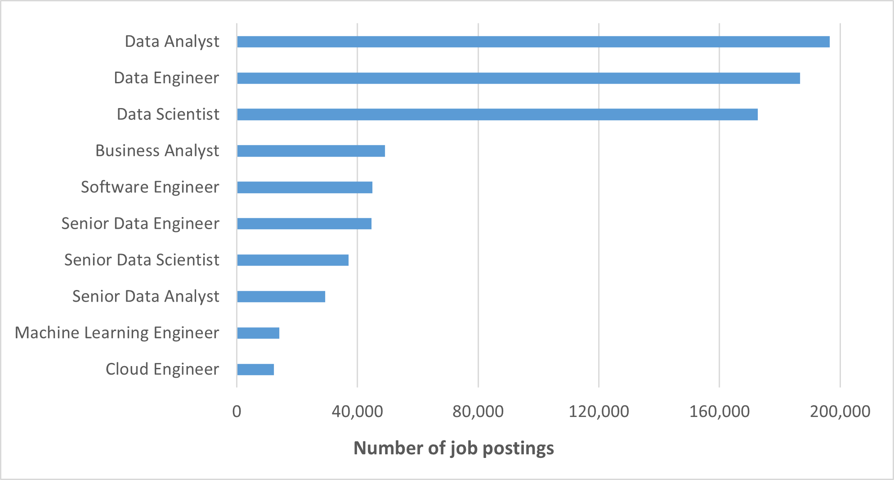
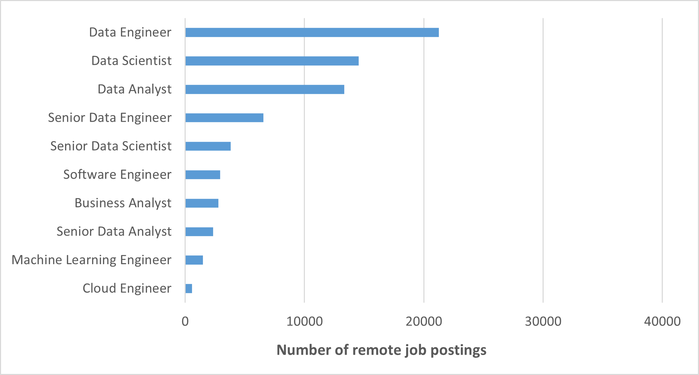
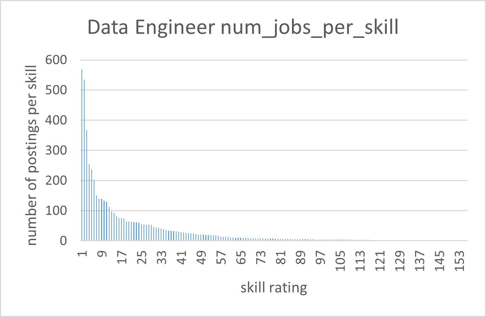
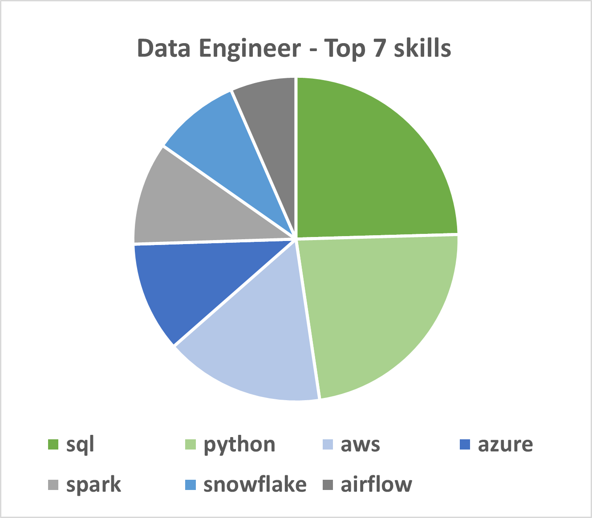
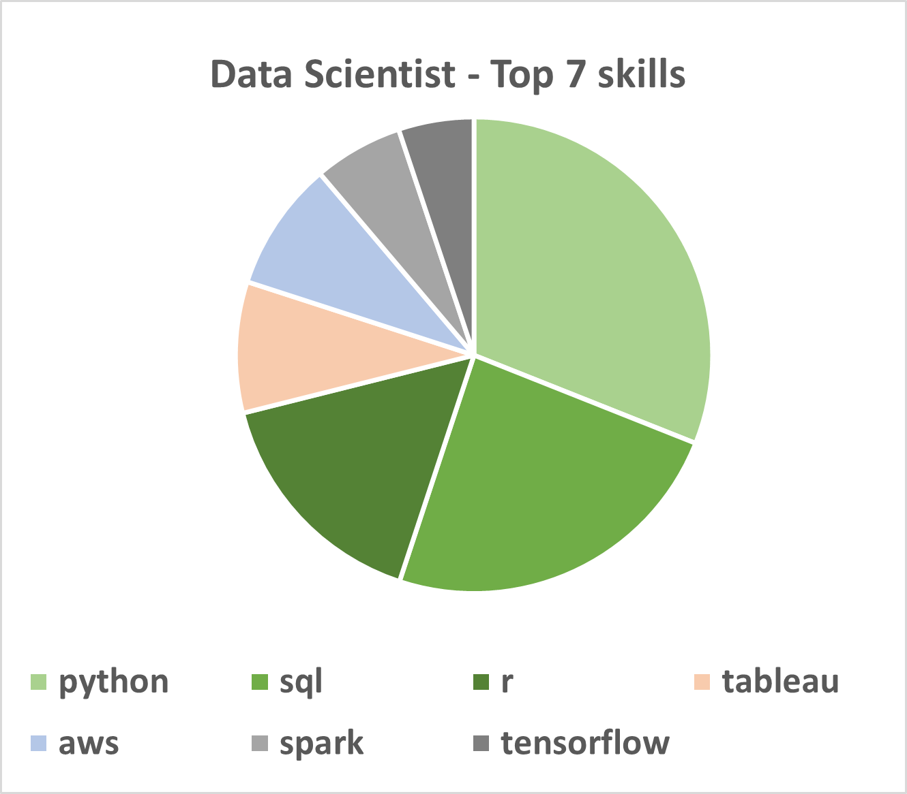
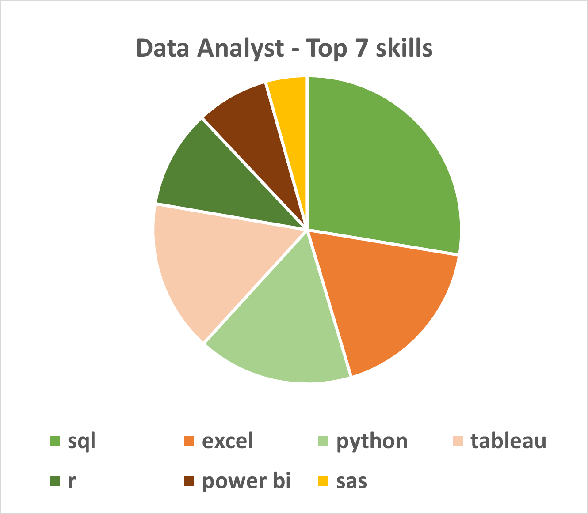
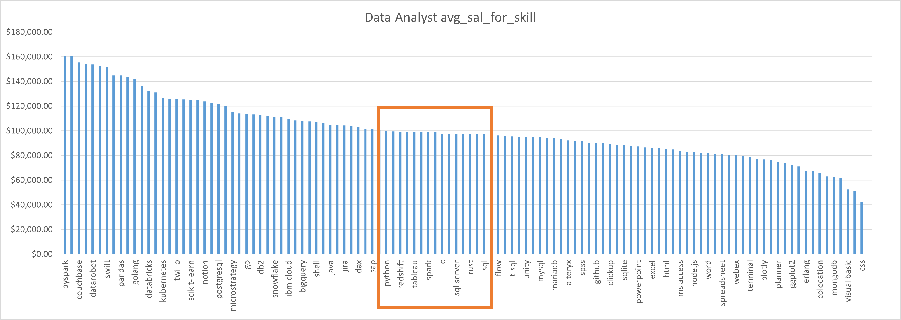

# Introduction
This project investigates the Data job market in terms of job type, highest paying jobs, skills required and job location options (including remote work) to help identify the most valuable skills, based on demand and salary, to prioritize for career development.
SQL queries for this evaluation can be found here: [project_sql folder](/project_sql/)

### Note: This is currently a work in progress and not the final version ###

# Background
This project was started as a way of learning how to apply SQL queries to draw valuable insights from extensive data sets. Much gratitude to Luke Barousse for hosting this course and providing the datasets.

I am a polymer scientist with extensive experience in handling data, but no experience with coding language, so this was an interesting experiment for me to conduct with data outside of my regular area of expertise, using specifically structured data query language.

## Questions to answer:
1. Which kind of data jobs have the highest demand? 
2. What are the typical skills required for these high-demand jobs?
3. What is the optimum career target at the intersection of demand (job availability) and skills required (my interest and transferability of prior experience)?
4. What are the top skills based on salary and remote work opportunities for my identified career target?
5. What are the most optimal skills to start learning? (high demand and high paying)


# Tools I used
- **SQL** as the main query language
- **PostgreSQL** as the database management system
- **Visual Studio Code** as the integrated development environment (IDE)
- **Git & GitHub** as the version control system and interface for sharing results

# The Analysis
Each query in this project was aimed at answering the 5 questions as outlined above:
### 1. Top demand data jobs
To identify the roles in highest demand, I conducted a simple count of job postings in the complete data base, ordered by the unique job title. 

```sql
SELECT
    COUNT (job_id) As num_of_posts,
    job_title_short
FROM
    job_postings_fact
GROUP BY
    job_title_short
ORDER BY
    num_of_posts DESC;
```
Since I am also specifically interested in remote work, I applied a second query to compare and contrast with the first one as I wanted to evaluate how the distribution changed for remote work opportunities. To do this, I simply modified the existing query with the clause:

``` sql
WHERE
    job_location = 'Anywhere'
```
directly preceding the 'GROUP BY' statement.


*Bar chart visualizing the number of job postings per role*     


*Bar chart visualizing the number of remote job postings per role*

**Total number of data job postings per job type**
| Rank | Job Title | Number of Posts |
|------|-----------|-----------------|
| 1 | Data Analyst | 196,593 |
| 2 | Data Engineer | 186,679 |
| 3 | Data Scientist | 172,726 |
| 4 | Business Analyst | 49,160 |
| 5 | Software Engineer | 45,019 |
| 6 | Senior Data Engineer | 44,692 |
| 7 | Senior Data Scientist | 37,076 |
| 8 | Senior Data Analyst | 29,289 |
| 9 | Machine Learning Engineer | 14,106 |
| 10 | Cloud Engineer | 12,346 |

**Total number of data job postings per *remote* job type**
| Rank | Job Title | Number of Posts |
|------|-----------|-----------------|
| 1 | Data Engineer | 21,261 |
| 2 | Data Scientist | 14,534 |
| 3 | Data Analyst | 13,331 |
| 4 | Senior Data Engineer | 6,564 |
| 5 | Senior Data Scientist | 3,809 |
| 6 | Software Engineer | 2,918 |
| 7 | Business Analyst | 2,786 |
| 8 | Senior Data Analyst | 2,352 |
| 9 | Machine Learning Engineer | 1,480 |
| 10 | Cloud Engineer | 571 |


From this data, there's a significant number postings for Data Analysts, Data Engineers and Data Scientsts, with senior levels of these, as well as other specialized positons having only about ~ 20 % of the available positions compared to the top 3. Since I am new to the world of data, I am not concerned about senior or specialized positions, so I decided to limit my subsequent queries to the top 3 roles ranked by demand. The top 3 roles are also the most abundant in the remote job subset but the breakdown changes slightly, where Data Engineers have signifcantly more remote job opportunities than Data Scientists or Data Analysts. Remote jobs represent only about 5-10 % of the total available jobs, suggesting a general preference for a physical presence or hybrid work arrangement by companies offering data jobs. 

### 2. Typical skills required in the top 3 data jobs
A quick check on the unique skills represented in the database:
``` sql
SELECT DISTINCT skills from skills_dim
```
revealed 252 distinct skills distributed among all the data jobs. To deal with this, I tried 3 subqueries, one for each position of interest to compare and contrast their skills distribution:

``` sql
SELECT 
    COUNT (job_postings_fact.job_id) AS num_jobs_per_skill,
    skills_dim.skills,
    skills_dim.type
FROM job_postings_fact
INNER JOIN skills_job_dim ON job_postings_fact.job_id = skills_job_dim.job_id
INNER JOIN skills_dim ON skills_job_dim.skill_id = skills_dim.skill_id
WHERE 
    job_title_short IN ('Data Engineer') AND
    job_location = 'Anywhere' AND
    salary_year_avg IS NOT NULL
GROUP BY 
skills,
type
ORDER BY
num_jobs_per_skill DESC
LIMIT 10;
```
Replacing the job title in subsequent queries to provide a comparable breakdown.
Removing the limit in each case revealed 155 (Data Engineer), 153 (Data Scientist) and 120 (Data Analyst) unique skills as described in the job postings for each job category.
From this data, I drew up a quick histogram to determine a reasonable cutoff for zooming in on the skills most freqenstly requested, which was around 7 in all 3 cases.

*An example of the histogram for the data engineer job postings*

Comparing the pie charts for each job type, it is clear that there's some overlap in the positions, with the Data Engineer skills mostly focused on programming (green), cloud (blue) and library (grey) skills, highlighting the importance of cloud infrastructure knowledge and big data/scalable processing methods.  The Data Analyst skills are mostly related to analysis tools (orange) and some programming skills, highlighting expertise in data visualization and manipulation.  The Data Scientist skill set represents a combination of the above, mostly focused on programming skills, but also requiring some breadth extending to data visualization and cloud skills.


*Pie chart visualizing the top skills required in Data Engineer postings* 


*Pie chart visualizing the top skills required in Data Scientist postings* 
                      

*Pie chart visualizing the top skills required in Data Analyst postings*

### 3. What is the optimum career target at the intersection of demand (job availability) and skills required (my interest and transferability of prior experience)?
Combining the information form the previous two queries, Data Analyst jobs appear to hit the sweet spot of abundance (job availability) and applicability of my existing skills (e.g. Excel and Power BI) which would represent the smoothest data job transition. Furthermore, this kind of position relies strongly on SQL and considering how much I enjoyed doing these SQL queries, this was a big plus. The trade-offs are that remote work options are not as abundant for Data Analysts compared to Data Engineers or Scientists and that the salary is likely to be lower (to be addressed in my next question). Additionally, with the rapid development of AI capabilities for data analysis and visualization, there are some current concerns that this may reduce the number of future Data Analyst jobs. In my queries I have shared the results with ChatGPT and asked for insights, which were valuable. I preferred to my own data processing and plotting in excel, rather than the automatically genearted images (adding some familiar skills to the new ones), so I think the skillful combination of AI with some human experience will still be greater than either alone or the.

### 4. What are the top skills based on salary and remote work opportunities for my identified career target?
Next, I applied the following SQL query to zoom in on the highest earning skills for a remote Data Analyst by calculating the average salary per posting aggregated for each skill and ranking them from high to low.

```sql
SELECT ROUND(AVG(job_postings_fact.salary_year_avg), 0) AS avg_sal_for_skill,
    skills
FROM job_postings_fact
    INNER JOIN skills_job_dim ON skills_job_dim.job_id = job_postings_fact.job_id
    INNER JOIN skills_dim ON skills_dim.skill_id = skills_job_dim.skill_id
WHERE job_title_short = 'Data Analyst'
    AND salary_year_avg IS NOT NULL
    AND job_location = 'Anywhere'
GROUP BY skills
ORDER BY avg_sal_for_skill DESC
```
**Average Salary for Data Analyst Skills**
| Skill | Average Salary |
|-------|----------------|
| PySpark | $208,172 |
| Bitbucket | $189,155 |
| Couchbase | $160,515 |
| Watson | $160,515 |
| DataRobot | $155,486 |
| GitLab | $154,500 |
| Swift | $153,750 |
| Jupyter | $152,777 |
| Pandas | $151,821 |
| Elasticsearch | $145,000 |


Interestingly, the top earning skills had an impressive related average salary of ~$200,000 e.g. PySpark and Bitbucket. As a newbie to the field, these were rather obscure, so I consulted Claude.ai which revealed that PySpark is used in big data processing, allowing for the use of the more common Python language as well as real-time streaming data processing and machine learning at scale. Bitbucket is a web-based version control repository (like GitHub) but with a stronger enterprise focus. A quick Excel search indicated that these skills only showed up in 1 or 2 job postings, so these are highly specialized and therefore not suitable to develop initially as skills. I also found that job postings containing the most frequently cited skills were centered around the average salary distribution of $100,000, confirming that these would be more than adequate to start developing. 

### 5. What are the most optimal skills to start learning? (high demand and high paying)
 Building further in the quick insight I gained from just viewing that data in Excel, I wanted to see whether there was a way to combine queries in SQL so I could still focus on high paying skills, however ones that were not as obscure or specialized, in order to equip me for the widest array of potential jobs.
 In order to do this, I combined the sum of the available jobs and average salary aggregations, though joining skills and job postings tables, but also added a HAVING clause on teh aggregated data to filter out any jobs with fewer than 100 postings (just an arbitrary number, but considering the total number of postings fulfilling the remote Data Analyst requirements, this still represented ~ 96 % of the job postings, with only 4% of the niche skills removed).

``` sql
SELECT
    skills_dim.skills,
    COUNT (skills_job_dim.job_id) AS num_jobs_for_skill,
    ROUND(AVG(job_postings_fact.salary_year_avg),0) AS avg_salary
FROM job_postings_fact
INNER JOIN skills_job_dim ON job_postings_fact.job_id = skills_job_dim.job_id
INNER JOIN skills_dim ON skills_job_dim.skill_id = skills_dim.skill_id
WHERE
    job_title_short = 'Data Analyst'
    AND salary_year_avg IS NOT NULL
    AND job_location = 'Anywhere'
GROUP BY
    skills_dim.skill_id
HAVING (COUNT (skills_job_dim.job_id))> 100
ORDER BY
    avg_salary DESC
```

**Highest paying and most abundant skills for a Data Analyst**
| Skill | Number of Jobs | Average Salary |
|-------|----------------|----------------|
| Python | 236 | $101,397 |
| R | 148 | $100,499 |
| Tableau | 230 | $99,288 |
| Power BI | 110 | $97,431 |
| SQL | 398 | $97,237 |
| Excel | 256 | $87,288 |

From the above table, Python and R are close competitors for the top earning spot, where Python is more widely applied, looking at the number of available jobs citing this skill and better for big data and machine learning applications. R, hwoever, is more specialized and frequently used in academia or research for statistical analysis and visualization. For now, I have decided to prioritize Python due to its wider applicability, however I will also look into R in future as I am interested in statistical evaluation of data and have been doing that informally in my research work to date, although not using specific coding languages, yet.
Following the programming skills are Tableau and Power BI for data visualization. While Tableau leads in the number of job postings, Power BI is less expensive and specialized. For this reason, as well as the fact that I have some basic experience with Power BI, I plan to start expanding my experience with Power BI first.

# Conclusions
This was a fun project to learn about the data jobs available in the job market. The databases and instructions (thanks Luke! https://www.lukebarousse.com/) were very useful to start developing an understanding of what the different positions entail, earn and require in terms of skill set. This allowed me to tailor my queries to answer questions relating to my particular topics of interest. I was suprised to see a relatively large number of specific skills required (120-160) for the various types of data jobs and these weren't even the senior or specialized roles. This, along with multiple options for similar types of skills, indicates some industry segmentation and less standardization. As a newcomer to this field, the overwhelming number of technical skills and jargon can be quite intimidating, which is why I found to focus on the numbers more reassuring. By not getting caught in the weeds of the jargon, but applying my science background to cut down on the noise (even for high paying unicorns) I could find a more cohesive story and solidify important skills to focus on for my Data Analysis journey. I confirmed that learning a skill like SQL is very useful for this kind of position, which I will further append with data visualization skills (Power BI) and programming language (Python). Since these skills are also required for Data Science, that will be a good baseline for me to add cloud skills (AWS) and complemenet my programming experience with something like R for specialized statistical evaluation in the longer term.
 

## Closing thoughts
The data industry is very dynamic, especially with the rapid development of AI capabilities, so the challenge remains how to best work with the technological resources available to optimize analysis time and output. For this particular project, the database was relatively dated (from 2023), so an additional challenge would be to get more recent job postings data and determine whether the same trends hold, or whether some shifts have occurred. To do this, I would have to build my own databases, which would require a whole new skill set - a challenge for another day!
